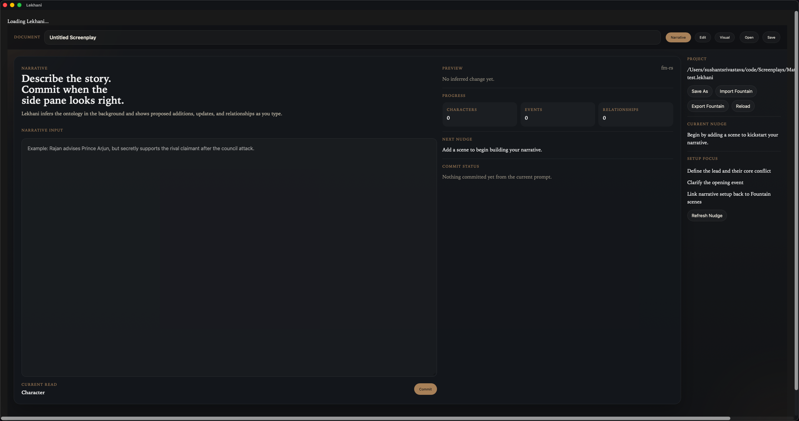

# Lekhani

Lekhani is a Tauri + Leptos desktop app for screenplay writing and narrative setup.

It treats the screenplay as a document, stores projects in `.lekhani` files backed by SQLite, supports Fountain import/export, and builds a structured narrative/ontology model from natural-language input.

## Screenshots

### Narrative Mode



### Visual Inspector


## Motion Demos

The repo can also generate short motion assets locally on macOS:

- `docs/screenshots/narrative-demo.mp4`
- `docs/screenshots/narrative-demo.gif`
- `docs/screenshots/visual-demo.mp4`
- `docs/screenshots/visual-demo.gif`

## Current Shape

- `Narrative` mode:
  - one writing surface for natural-language setup
  - live inferred preview in a side pane
  - single commit action
- `Edit` mode:
  - plain Fountain editor
- `Visual` mode:
  - one scrollable inspector for derived narrative state

The backend currently hydrates:
- characters
- events
- character-to-character relationships
- event participation links
- ontology projection links

## Project Format

- Primary format: `.lekhani`
  - SQLite-backed project file
- Interchange format: `.fountain`
  - import/export only

## Stack

- Frontend: Leptos
- Desktop shell: Tauri 2
- Persistence: SQLite via `rusqlite`
- Local macOS LLM path: `fm-rs`
- Fallback hydration path: local heuristic engine

## Repository Layout

- [`frontend`](/Users/sushantsrivastava/code/Screenplays/MathuraStruggle/frontend): Leptos UI
- [`src-tauri`](/Users/sushantsrivastava/code/Screenplays/MathuraStruggle/src-tauri): Tauri app and backend
- [`src-tauri/migrations`](/Users/sushantsrivastava/code/Screenplays/MathuraStruggle/src-tauri/migrations): SQLite migrations
- [`AGENTS.md`](/Users/sushantsrivastava/code/Screenplays/MathuraStruggle/AGENTS.md): project-specific agent guardrails

Backend modules are split into:
- `domain`
- `application`
- `ports`
- `adapters`

## Getting Started

Requirements:

- Rust toolchain
- `cargo tauri`
- `trunk`
- macOS if you want to use the `fm-rs` Foundation Models path

Common commands:

```bash
make dev
make build
make launch
make screenshots
make motion
make quick-test
```

`make screenshots` is a local macOS helper that launches the bundled app and regenerates the README images in `docs/screenshots/`. It relies on AppleScript UI scripting and screen capture, so Terminal needs Accessibility permission.

`make motion` records short window captures and emits both `mp4` and `gif` assets. It requires:

- macOS
- `ffmpeg`
- Screen Recording permission for Terminal
- Accessibility permission for Terminal

If `ffmpeg` targets the wrong display, set `DISPLAY_INDEX` when running the script:

```bash
DISPLAY_INDEX=1 ./scripts/capture_readme_motion.sh
```

If the macOS accessibility tree does not expose the mode buttons by name, the capture scripts fall back to window-relative clicks. You can tune those offsets if needed:

```bash
NARRATIVE_TAB_X_OFFSET=390 \
EDIT_TAB_X_OFFSET=465 \
VISUAL_TAB_X_OFFSET=535 \
MODE_TAB_Y_OFFSET=48 \
./scripts/capture_readme_motion.sh
```

## Development Notes

- `Narrative` mode is the primary authoring surface.
- `Visual` mode is a read-oriented inspector over derived model state.
- The UI intentionally avoids heavy manual ontology editors; the assistant is the main mutation path.
- If Foundation Models is unavailable or rejects a request, the app falls back to the local heuristic hydrator.

## Status

Implemented:

- working Leptos + Tauri desktop integration
- `.lekhani` document workflow
- Fountain import/export
- SQLite persistence with migrations
- narrative message preview/commit flow
- relationship hydration
- simplified document-centered UI

Still rough:

- multi-entity intent handling beyond one primary inferred target
- richer relationship types
- screenplay patch proposals instead of appending narrative notes
- provider configuration for non-Apple LLM backends
